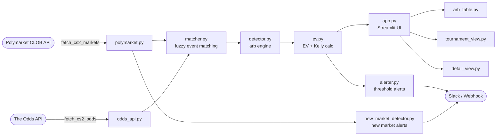

# CS2 Esports Arbitrage Dashboard

[](https://github.com/simonncollins/cs2-arb-dashboard/actions/workflows/ci.yml)

A Streamlit dashboard that compares **Polymarket** prediction-market odds against **traditional bookmaker** implied probabilities for CS2 esports matches, surfacing potential arbitrage opportunities in real time.

> **Disclaimer:** This tool is for informational and research purposes only. It is **not** financial advice. Arbitrage opportunities may close before execution, and odds shown may not reflect current market conditions. Always verify independently before acting.

---

## Features

- **Live data ingestion** from [Polymarket CLOB API](https://clob.polymarket.com) and [The Odds API](https://the-odds-api.com)
- **Fuzzy event matching** to correlate markets across platforms
- **Arbitrage detection engine** with configurable minimum-edge threshold
- **Expected-value (EV) calculator** with Kelly fraction sizing
- **Tournament view** — filtered to BLAST/IEM/ESL major events (⚡)
- **Auto-refreshing dashboard** (default: every 60 seconds)
- **Webhook / Slack alerts** for high-value opportunities
- **New market alerts** — notifies when a fresh Polymarket CS2 market appears

---

## Architecture



**Data flow:**
1. `polymarket.py` fetches active CS2 markets from Polymarket's CLOB API (no auth required)
2. `odds_api.py` fetches bookmaker lines from The Odds API (requires `ODDS_API_KEY`)
3. `matcher.py` fuzzy-matches events across both sources by team names
4. `detector.py` computes implied probability divergences and filters by configurable minimum edge %
5. `ev.py` computes adjusted expected value and Kelly fraction for each opportunity
6. `app.py` orchestrates auto-refresh, sidebar controls, and tab-based UI layout
7. `alerter.py` fires webhook/Slack notifications for opportunities above threshold

---

## Project Structure

```
cs2-arb-dashboard/
├── app.py                      # Streamlit entry point
├── config.py                   # Top-level config shim
├── cs2_arb/
│   ├── alerts/
│   │   ├── alerter.py          # Threshold-based alert manager
│   │   ├── new_market_detector.py  # New Polymarket market detection
│   │   └── notifier.py         # Slack + generic webhook notifiers
│   ├── api/
│   │   ├── odds_api.py         # The Odds API client
│   │   └── polymarket.py       # Polymarket CLOB client
│   ├── data/
│   │   └── blast_events.py     # BLAST/major tournament keyword registry
│   ├── engine/
│   │   ├── detector.py         # Core arbitrage detection engine
│   │   ├── ev.py               # EV and Kelly fraction calculator
│   │   └── tournament_detector.py  # Tournament-scoped detection
│   ├── ui/
│   │   ├── arb_table.py        # Main arbitrage opportunities table
│   │   ├── detail_view.py      # Match detail drill-down view
│   │   └── tournament_view.py  # BLAST/major events tab
│   └── config.py               # Package-level config (API URLs, thresholds)
├── tests/                      # pytest test suite (149+ tests)
├── .streamlit/
│   ├── config.toml             # Streamlit theme & server config
│   └── secrets.toml.example    # Secret template (do not commit secrets)
├── .env.example                # Environment variable template
├── requirements.txt            # Runtime dependencies (for Streamlit Cloud)
└── pyproject.toml              # Build config, ruff + mypy settings
```

---

## Local Setup

### Prerequisites

- Python 3.11+
- A free [The Odds API](https://the-odds-api.com) key (500 requests/month on free tier)

### 1. Clone and install

```bash
git clone https://github.com/simonncollins/cs2-arb-dashboard.git
cd cs2-arb-dashboard
pip install -r requirements.txt
```

### 2. Configure secrets

```bash
cp .env.example .env
# Edit .env and set ODDS_API_KEY=your_key_here
```

Alternatively, copy the Streamlit secrets template:

```bash
cp .streamlit/secrets.toml.example .streamlit/secrets.toml
# Edit .streamlit/secrets.toml and set ODDS_API_KEY
```

### 3. Run the app

```bash
streamlit run app.py
```

The dashboard will open at `http://localhost:8501`.

---

## Environment Variables

| Variable | Required | Default | Description |
|---|---|---|---|
| `ODDS_API_KEY` | ✅ Yes | — | API key from [the-odds-api.com](https://the-odds-api.com). Free tier: 500 req/month. |
| `SLACK_WEBHOOK_URL` | No | — | Slack incoming webhook URL for arb alerts. Leave empty to disable. |
| `ALERT_WEBHOOK_URL` | No | — | Generic HTTP webhook URL for arb alerts (JSON POST). Leave empty to disable. |
| `REFRESH_INTERVAL_SECONDS` | No | `60` | How often the dashboard auto-refreshes data (seconds). |
| `MIN_ARBITRAGE_EDGE_PCT` | No | `2.0` | Minimum edge % to display/alert on. Can also be adjusted via sidebar slider. |

---

## Streamlit Cloud Deployment

### 1. Connect the repo

1. Go to [share.streamlit.io](https://share.streamlit.io) and sign in
2. Click **New app**
3. Select repo: `simonncollins/cs2-arb-dashboard`
4. Main file path: `app.py`
5. Python version: `3.11` (pinned in `runtime.txt`)

### 2. Configure secrets

In the Streamlit Cloud app settings → **Secrets**, add:

```toml
ODDS_API_KEY = "your_odds_api_key_here"

# Optional
SLACK_WEBHOOK_URL = ""
ALERT_WEBHOOK_URL = ""
```

### 3. Deploy

Click **Deploy**. The app will install dependencies from `requirements.txt` automatically.

---

## Data Sources

| Source | Auth | Documentation |
|---|---|---|
| [Polymarket CLOB API](https://clob.polymarket.com) | None required | [Polymarket CS2 markets](https://polymarket.com/sports/esports) |
| [The Odds API](https://the-odds-api.com) | `ODDS_API_KEY` | [API docs](https://the-odds-api.com/liveapi/guides/v4/) |

CS2 markets on Polymarket are tagged `esports` / `cs2`. The Odds API is queried for `esports` sport key with `cs2` league filter.

---

## Limitations

- **Odds latency:** Polymarket and bookmaker odds are fetched on each refresh cycle. There may be a delay of up to 60 seconds between real-world changes and dashboard display.
- **Polymarket fee:** The ~2% CLOB fee is not always reflected in displayed edge %. Verify net edge after fees before acting.
- **Market closure:** Arbitrage windows may close between the time they are detected and the time you place a bet.
- **Free-tier API quotas:** The Odds API free tier is limited to 500 requests/month. The dashboard caches responses to minimise usage.
- **No execution:** This dashboard is read-only. It does not place bets or interact with any betting platform.

---

## Development

```bash
# Install dev dependencies
pip install -e ".[dev]"

# Run tests
pytest

# Lint
ruff check .

# Type check
mypy cs2_arb
```
