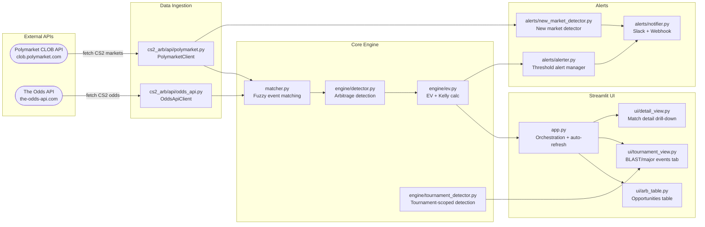

# Architecture Overview

This document describes the system architecture of the CS2 Esports Arbitrage Dashboard.

---

## High-Level Data Flow

---

## Component Descriptions

### `cs2_arb/api/polymarket.py` — Polymarket CLOB Client

Fetches active CS2 prediction markets from Polymarket's Gamma/CLOB API.

- No authentication required.
- Queries `/markets?tag=esports&status=active` and filters by CS2 keyword.
- Returns `PolymarketMarket` dataclass list (market_id, team_a, team_b, yes_price, no_price, closes_at).
- Response is cached (TTL configurable via `POLYMARKET_CACHE_TTL_SECS`) to reduce API calls.

### `cs2_arb/api/odds_api.py` — The Odds API Client

Fetches current bookmaker lines for CS2 esports matches.

- Requires `ODDS_API_KEY` environment variable.
- Queries `esports` sport key, filtering for CS2 leagues.
- Returns American/decimal odds for each outcome; converts to implied probability with vig removal.
- Caches responses to stay within free-tier quota (500 req/month).

### `cs2_arb/engine/detector.py` — Arbitrage Detection Engine

Core engine that identifies price divergences between Polymarket and bookmakers.

- Accepts a list of matched event dicts (from the matcher).
- Applies the Polymarket taker fee (default 2%) to adjust Polymarket probabilities.
- Computes `edge_pct = (poly_prob_adj - book_prob) * 100`.
- Filters to `edge_pct >= min_edge_pct` (configurable, default 0.5%).
- Returns `MatchArbitrageOpportunity` dataclass list, sorted by edge descending.

### `cs2_arb/engine/ev.py` — EV and Kelly Calculator

Annotates detected opportunities with expected value and Kelly fraction.

- `compute_ev(poly_prob, book_implied_prob, poly_fee)` → float
- `compute_kelly(edge, odds)` → float (display only — not for automated execution)
- `annotate_opportunities(opportunities)` → mutates list in-place with ev_adjusted, kelly_fraction, is_significant

### `cs2_arb/engine/tournament_detector.py` — Tournament-Scoped Detection

Wraps the core detector to filter results to BLAST/major tournament events only.

- Delegates to `cs2_arb.data.blast_events.is_blast_event()` for classification.
- Used by the **Tournament** tab in the Streamlit UI.

### `cs2_arb/data/blast_events.py` — BLAST/Major Keyword Registry

Single source of truth for what constitutes a BLAST/major CS2 tournament.

- `is_blast_event(event_name: str) -> bool`
- Matches against a curated keyword list: `blast`, `iem`, `esl`, `major`, `cologne`, `rio`, `paris`, and more.
- All UI components that need BLAST detection call this function — no inline keyword lists elsewhere.

### `cs2_arb/alerts/alerter.py` — Threshold Alert Manager

Fires alerts when opportunities exceed a configurable edge threshold.

- Deduplicates by `{event_name}|{outcome}` key within a 1-hour cooldown window.
- Persists dedup log to JSON (`alert_log.json`).
- Silently handles filesystem errors (safe for Streamlit Cloud read-only mode).

### `cs2_arb/alerts/new_market_detector.py` — New Market Detector

Detects when a new Polymarket CS2 market launches.

- First call establishes a JSON snapshot baseline (no alerts fired).
- Subsequent calls diff current `market_id`s against the snapshot.
- Returns `NewMarketAlert` objects with `market_id`, `question`, `volume_usd`, `polymarket_url`.

### `cs2_arb/alerts/notifier.py` — Slack + Webhook Notifier

Delivers alert payloads to external services.

- `SlackNotifier(webhook_url)` — sends formatted Slack messages via incoming webhook.
- `WebhookNotifier(webhook_url)` — sends JSON POST to a generic HTTP endpoint.
- Both are no-ops if `webhook_url` is not configured.

### `cs2_arb/ui/arb_table.py` — Arbitrage Opportunities Table

Renders the main sortable/filterable opportunities table in Streamlit.

- Accepts a list of `MatchArbitrageOpportunity` objects.
- BLAST events are prefixed with ⚡ using `is_blast_event()`.
- Columns: Event, Outcome, Poly Prob, Book Prob, Edge %, EV (adj), Volume ($), Kelly %, Book.
- Inline sort controls (sort column + ascending/descending).

### `cs2_arb/ui/tournament_view.py` — Tournament View

BLAST/major-event-filtered tab in the UI.

- Delegates filtering to `tournament_detector.py`.
- Shows a summary stats bar: opportunity count, max edge, total volume.

### `cs2_arb/ui/detail_view.py` — Match Detail View

Drill-down view for a single match showing both Polymarket and bookmaker lines side-by-side.

### `app.py` — Streamlit Entry Point

Top-level orchestration:

1. Reads config from environment / `.streamlit/secrets.toml`.
2. Fetches data from both APIs (with caching).
3. Runs matcher → detector → EV annotator pipeline.
4. Renders sidebar controls (refresh interval, min edge % slider, sport filter).
5. Tabs: **All Opportunities** | **BLAST/Majors** | **Match Detail**.
6. Auto-refreshes on configurable interval via `st.rerun()`.
7. Fires alerts via `AlertManager` and `NewMarketDetector` on each refresh.

---

## Key Design Decisions

### Single-source BLAST detection

All components that need to classify an event as a BLAST/major tournament call `cs2_arb.data.blast_events.is_blast_event()`. This avoids keyword list duplication and makes adding new tournaments a one-line change.

### Silent filesystem failures

Both `AlertManager` and `NewMarketDetector` catch `OSError` on all JSON read/write operations. Streamlit Community Cloud provides a read-only filesystem outside `/tmp`, so this prevents crashes in production.

### Polymarket fee adjustment

The 2% Polymarket taker fee is applied before computing edge: `poly_prob_adj = poly_prob * (1 - fee)`. This makes edge calculations conservative — only opportunities that survive the fee are surfaced.

### Caching strategy

Both API clients cache responses using Streamlit's `@st.cache_data(ttl=...)` decorator. This prevents re-fetching on every UI interaction while still keeping data fresh on the auto-refresh cycle.
